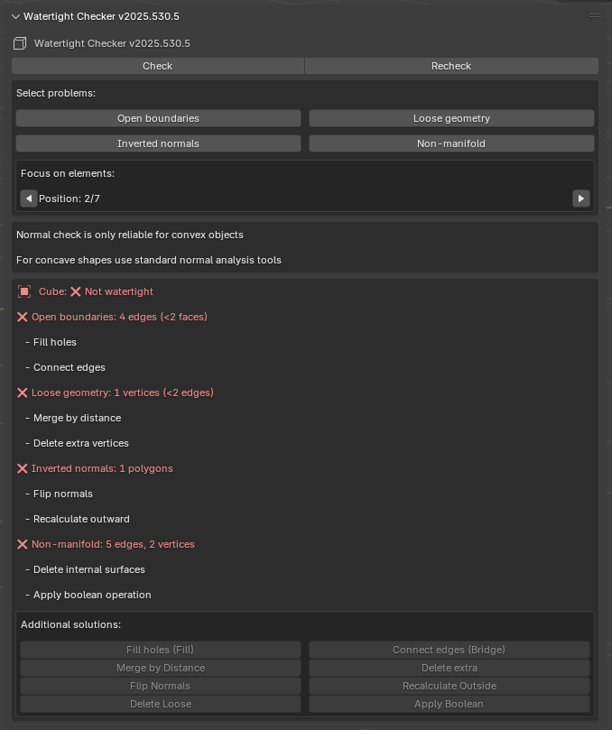

# Blender Watertight Checker

 

Расширение для Blender, которое проверяет замкнутость (watertight) геометрии для корректной работы Cull Front и теневых карт (shadow maps).

## Что такое Watertight Mesh и почему это важно?

**Watertight Mesh** (водонепроницаемый меш) - это полностью замкнутая 3D-модель без отверстий, открытых граней или неплотных вершин. Такой меш представляет собой "герметичную" поверхность, где каждая грань соединена как минимум с двумя другими гранями, а все нормали направлены наружу.

Эта характеристика критически важна для:
1. **Cull Front (отсечение передних граней)** - техника рендеринга, используемая для устранения артефактов при рендеринге прозрачных материалов или эффектов типа "стекла". Если меш не является водонепроницаемым, при отсечении передних граней появляются визуальные артефакты и "протечки".

2. **Теневые карты (Shadow Maps)** - для корректного расчета теней геометрия должна быть замкнутой. Неплотные соединения или отверстия в меше вызывают артефакты теней, "протекание" света и неправильное затенение.

3. **Симуляции жидкостей** - при работе с жидкостями незамкнутая геометрия приводит к утечкам жидкости и нереалистичному поведению.

## Основные функции

- Проверка нескольких типов проблем геометрии:
  - Открытые границы (Open boundaries)
  - Неплотные соединения (Loose geometry)
  - Перевернутые нормали (Inverted normals)
  - Не manifold геометрия (Non-manifold geometry)
  - N-угольники (N-Gons)
  - Самопересечения (Self-intersections)
  
- Автоматическое выделение проблемных участков
- Пошаговая навигация по проблемным элементам с фокусировкой камеры
- Автоматический фокус на проблемной области при выделении типа проблемы
- Подробный отчет с рекомендациями по исправлению
- Интеграция стандартных инструментов Blender для быстрого исправления
- **[Видео-демонстрация установки и работы аддона](https://youtu.be/TFofQ0Mir44)** (v2025.0528, на последней версии пока не переснял)

## Установка

1. Скачайте последнюю версию расширения:
   - [Ссылка для скачивания](https://github.com/romanilyin/BlenderWatertightChecker/releases)

2. В Blender:
   - Откройте `Edit > Preferences > Add-ons`
   - Нажмите `Install...` и выберите скачанный ZIP-файл
   - Активируйте расширение, поставив галочку напротив "Watertight Mesh Checker"

3. Панель инструментов появится во вкладке "Инструменты" в правой панели 3D-вида:
  - Нажмите `N` на клавиатуре, чтобы открыть сайдбар (или щелкните на маленькую стрелку в правой части 3D-окна)
  - Перейдите на вкладку "Инструменты"
  - Найдите панель "Watertight Checker"

    

## Использование

1. **Проверка геометрии:**
   - Выделите один или несколько mesh-объектов
   - На панели Watertight Checker нажмите кнопку `Check`
   - Для обновления геометрии после изменений используйте `Recheck`

2. **Просмотр результатов:**
   - Система покажет отчет о состоянии каждого объекта:
     - ✅ Замкнут (Watertight)
     - ❌ НЕ замкнут (Not watertight)
   - Подробный список проблем с рекомендациями по исправлению

3. **Выделение проблемных участков:**
   - При обнаружении проблем появятся кнопки для выделения:
     - Открытые границы
     - Неплотные соединения
     - Перевернутые нормали
     - Non-manifold геометрия
     - N-Gons (полигоны с более чем 4 вершинами)
     - Самопересечения граней
   - При нажатии на кнопку камера автоматически фокусируется на проблемной области

4. **Навигация по проблемным элементам:**
   - После выделения проблемы появятся кнопки навигации (◀ ▶)
   - Перемещайтесь между проблемными элементами
   - Камера автоматически фокусируется на текущем элементе
   - Отображается текущая позиция в формате "Позиция: X/Y"

5. **Быстрое исправление:**
   - Используйте встроенные кнопки для вызова стандартных инструментов Blender:
     - Заполнить отверстия (Fill)
     - Соединить края (Bridge)
     - Объединить по расстоянию (Merge by Distance)
     - Перевернуть нормали (Flip Normals)
     - Удалить лишнее (Delete Loose)
     - Применить Boolean операцию
     - Триангулировать N-gons
     - Исправить пересечения

## Новое в версии 2025.1006.1
- Добавлена проверка на самопересечения
- Новые кнопки для выделения N-gons и самопересечений

## Новое в версии 2025.530.2

- Добавлена навигация по проблемным элементам (кнопки ◀ ▶)
- Автоматический фокус камеры на каждом проблемном элементе
- Фокус на всей проблемной области при выделении типа проблемы
- Отображение текущей позиции в списке элементов
- Исправлена работа с non-manifold геометрией
- Улучшена стабильность работы плагина
## Важные примечания

- Проверка нормалей работает корректно только для **выпуклых объектов**. Для сложных вогнутых форм используйте стандартные инструменты анализа нормалей Blender (overlay - face orientation).
- Для получения актуальных данных после исправлений используйте кнопку `Recheck`.
- Расширение автоматически переключает режимы редактирования для сохранения изменений при использовании `Recheck`.
- При навигации по элементам масштаб просмотра сохраняется постоянным для удобства сравнения.
- N-угольники (N-gons) могут вызывать проблемы при экспорте в игровые движки и должны быть преобразованы в треугольники или четырехугольники.
- Самопересечения критически важны для устранения, так как движки часто отбрасывают такие полигоны.

## Поддержка

Если вы столкнулись с проблемами или у вас есть предложения по улучшению:
- [Сообщить об ошибке](https://github.com/yourusername/BlenderWatertightChecker/issues)
- [Написать автору](mailto:roman.ilyin@gmail.com)
- [Написать автору в телеграмм канале](https://t.me/gamedev_stinger)
- [Написать автору в телеграмм лично](https://t.me/romanilyin)

---

**Автор:** Roman Ilyin
**Версия:** 2025.1006.1
**Лицензия:** MIT
**Поддерживаемые версии Blender:** 4.4.0+